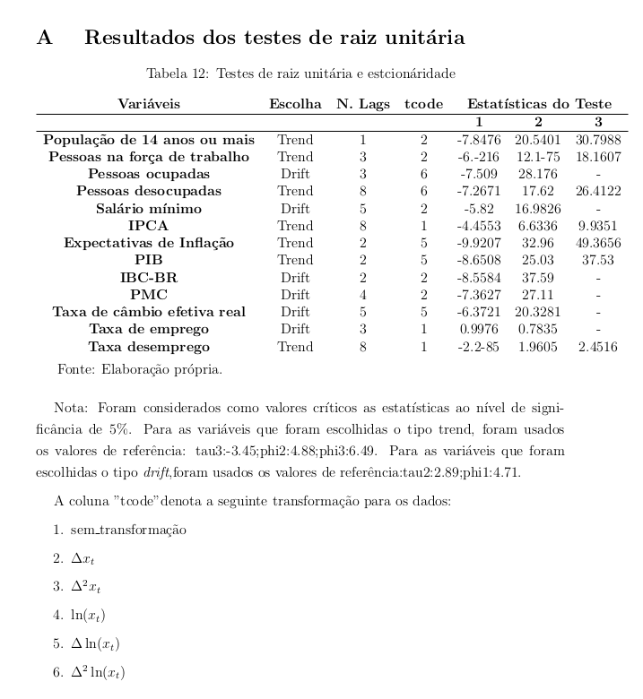
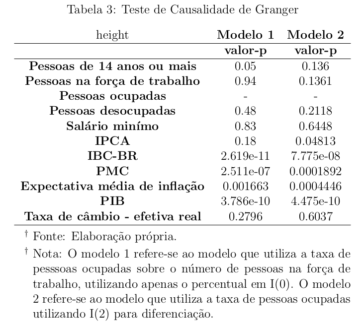
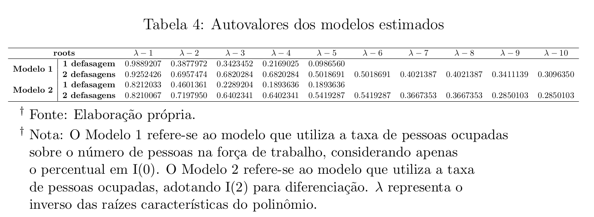
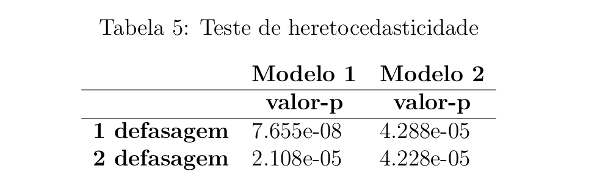
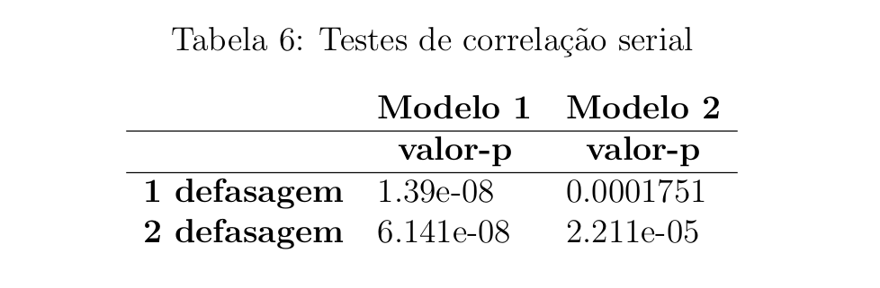

# Econometria III - Testes

1. Verificação de sazonalidade nas séries individuais com a biblioteca `seas` (p. 18)
2. Estacionaridade das séries individuais via Augmented Dickey-Fuller (ADF): estatísticas do teste, número de lags e testes com tendência, drift e sem nenhuma das duas (no Anexo I). (p. 18)

    - O que é `tendência`, `drift`, `cointegração` e como definir número de lags (talvez a própria biblioteca usada forneça)
    > Mazali e Divino, 2010, que, após uma bateria de testes de raiz unitária, concluiu que as séries brasileiras de inflação e desemprego são estacionárias. Portanto, descartou-se a possibilidade de cointegração dessas séries. (p. 18)
    - Procurar por estudos sobre VAR nas expectativas do FOCUS
3. Determinar as variáveis via teste de Granger (hipótese nula postula que valores passados de X não causam Y); quanto as previsões de Y melhoram ao incluir os valores passados de X no modelo
    - adicionar variáveis de acordo com literatura e interpretação econômica (PIB faz sentido nesse caso?)
    
    
    
## Testes | Resultados

### Tabela 2: estabilidade do modelo

### Tabela 3: heterocedasticidade

### Tabela 4: correlação serial

## Passo-a-passo
1. Apresente os dados: plotte os gráficos de expectativas; explique os métodos de coleta e pq esses dados foram escolhidos

2. Decomposição entre tendência, sazonalidade e erro - quais fatores econômicos podem gerar cada um deles

3. Autocorrelação, autocorrelação parcial e teste de raiz unitária: PCA analysis

4. Identifique o SARIMA

5. Ljung-Box para 4, 12 e 24 meses; analise a normalidade dos resíduos de cada modelo; heterocedasticidade ARCH LM

6. Teste de acurácia fora da amostra: separe em dados de treino e dados de testef
